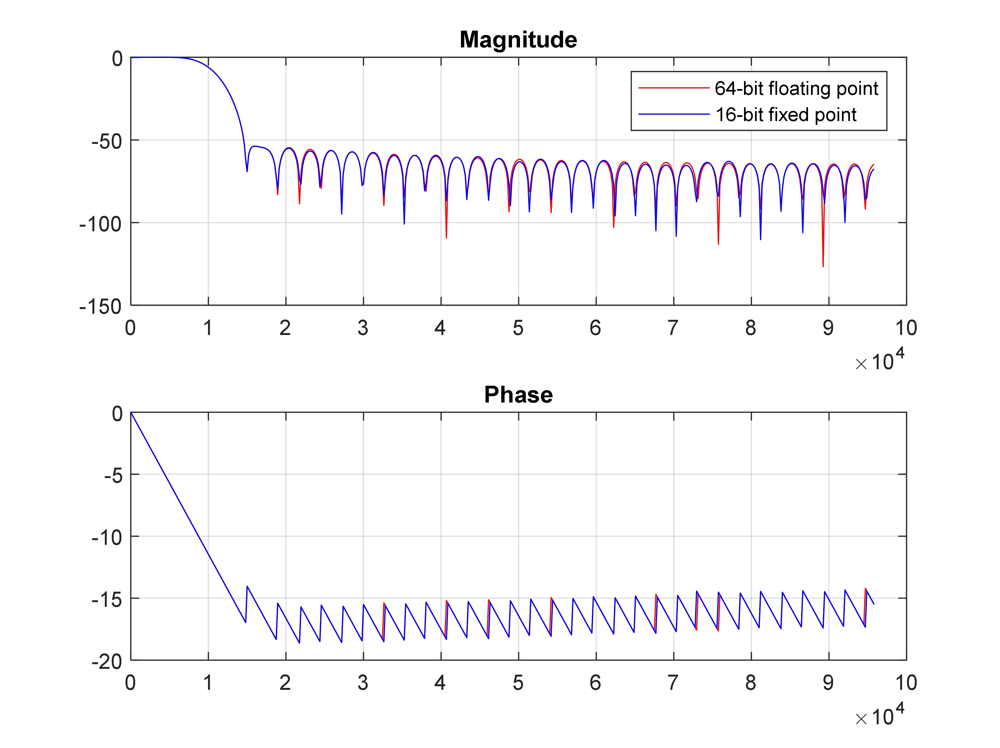
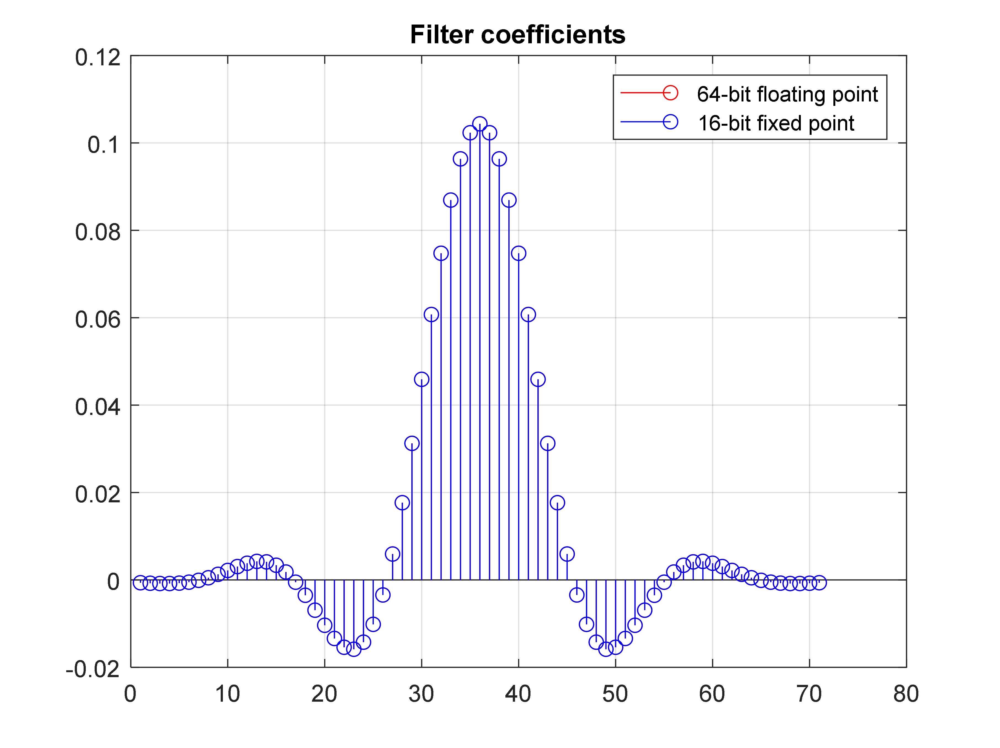
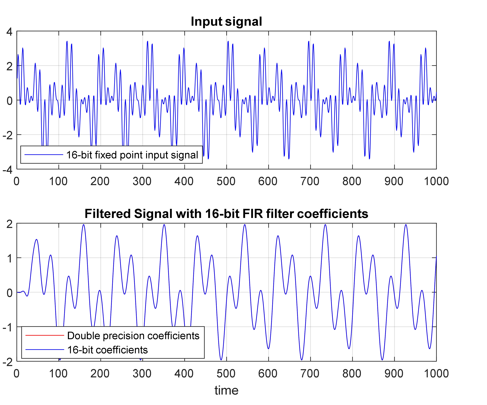
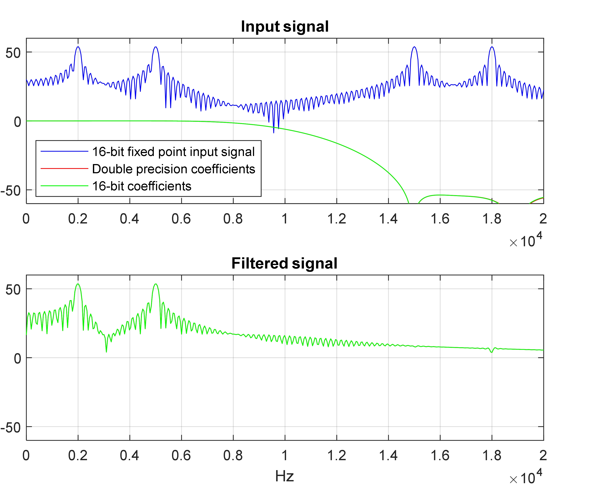
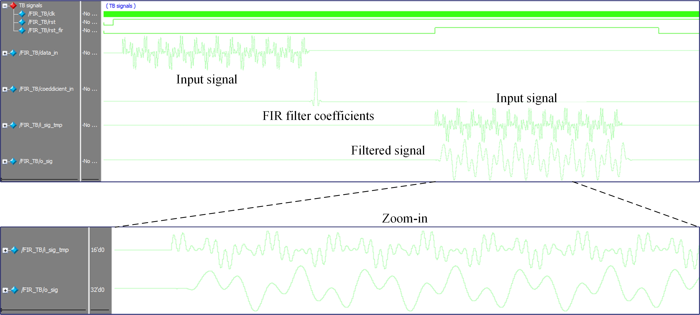

# Finite Impulse Reponse (FIR) Filter

> SystemVerilog FIR filter  

SystemVerilog implementation of __generalized FIR filter module__

## Get Started

The source files  are located at the repository root:

- [FIR filter Matlab script](./FIR_Design.m)
- [FIR filter](./FIR.sv)
- [FIR filter coefficients](./filter_coefficients.txt)
- [Input signal](./input_signal.txt)
- [FIR filter TB](./FIR_TB.sv)

##
This repository containts a SystemVerilog implementation of a parametrized finite impulse reponse (FIR) filter as well as a Matlab script for coefficient selection and input data pre-processing. Theoretical background can be found in [XXX](https://www.pololu.com/file/0J435/UM10204.pdf).

##Matlab script
The filter coefficients are obtained from the attached Matlab script which also converts the floating point representation of the built-in 'fir1' function into a user-defined fixed-point representation. In addition, the input signal to be filtered undergoes similar convertion to fixed-point representation.These are exported to two text files ('filter_coefficients' and 'input_signal') which are then imported to the TB.
The script is completely parametrized and can be used to obtain different filters (LPF,BPF,HPF...) and fixed-point representation lengths.
The coefficeints in this example are derived to satisfy:
	1.Passband frequency of 10kHz
	2.Stopband frequency of 15kHz
	3.Stopband attenuation in dB
	4.Sampling frequency of 192kHz
	
**Frequency response of the FIR filter for floating-point and 16-bit fixed point representation:**
	  

**FIR filter coefficients:**
	  

**Time domain signals (input signal and the filtered signal):**
	 
	
**Frequency domain signals (input signal, filter frequency response and the corresponding filtered signal):**
	 	
	
## Testbench
The filter coefficients and time-domain signal are imported to the TB from the attached text files. The coefficients are wired to the FIR filter module while the input signal is stored in a queue which pops a single data point per clock cycle (when the filter is activated).
The input signal is: $\sin(2*pi*1000*t) +  sin(2*pi*2000*t) + sin(2*pi*15000*t)  + sin(2*pi*18000*t)$
In the attached picture, the time-domain signal and filter coefficeints are shown. In addition, the input signal and its filtered counterpart are plotted after the filter is activated. As can be seen it mataches the results obtained from Matlab. 

**FIR filter operation:**
	  
		
		
## Support

I will be happy to answer any questions.  
Approach me here using GitHub Issues or at tom.urkin@gmail.com